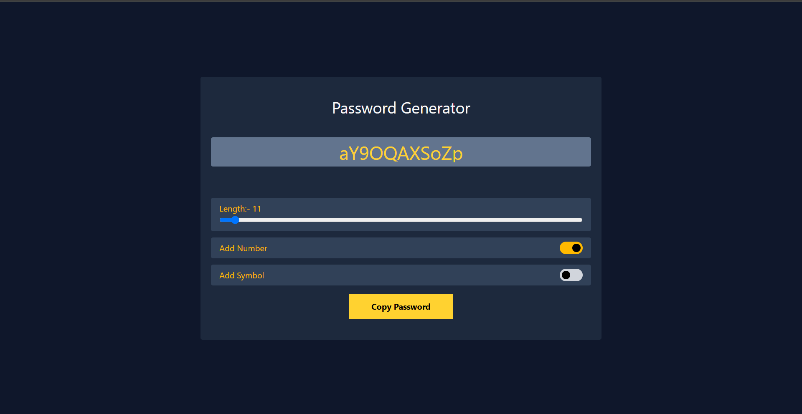

# 🔐 Password Generator

[](https://vitejs.dev/)  
[](https://tailwindcss.com/)  

A clean and responsive password generator built with **React (Vite)** and styled using **Tailwind CSS**.  
Users can create strong passwords with custom options and copy them to the clipboard in one click.

---

## 🚀 Features

- 📏 Choose password length with an interactive slider  
- 🔢 Option to include **numbers**  
- 🔣 Option to include **symbols**  
- 🧩 Mix characters, numbers, and symbols for strength  
- 📋 **Copy to clipboard** functionality  
- 🎨 Sleek UI with **Tailwind CSS**  
- ⚡ Super fast development with **Vite**

---

## 🖼️ Screenshots


| GUI |
|-----|------------------|--------|
|  |

---

## 🛠️ Tech Stack

- **Frontend:** React (via [Vite](https://vitejs.dev/))
- **Styling:** Tailwind CSS

---

## 🧑‍💻 Getting Started

To run this project locally:

```bash
git clone https://github.com/rakeshbhati-dev/Password-Generator
cd Password-Generator
npm install
npm run dev
```

---

## 🙋‍♂️ Author

- **Rakesh Bhati** – [GitHub](https://github.com/rakeshbhati-dev)

---


## 🌟 Support

If you like this project, leave a ⭐️ on the repo to show some love!
